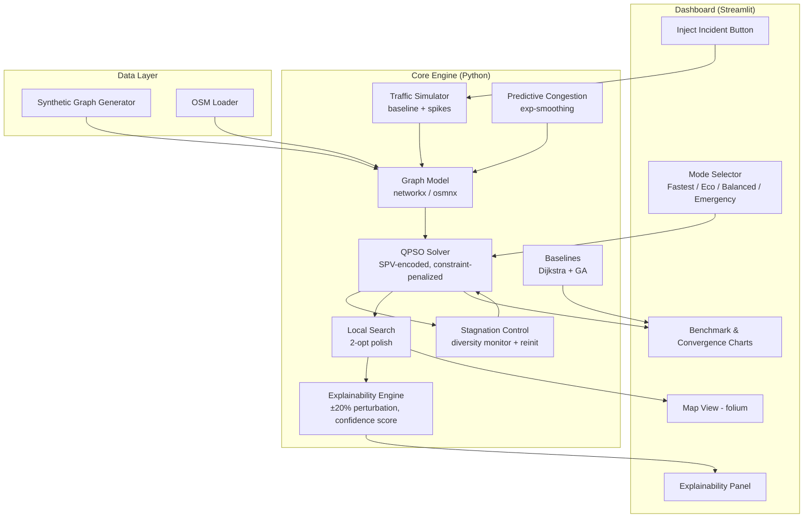

# System Architecture — SIH26137

## Data flow narrative (for the PPT slide)
1. **Input**: graph loaded (synthetic or real OSM area) + vehicle/demand data.
2. **Traffic state**: simulator sets baseline congestion; incident button or predictive
   layer can modify edge weights live.
3. **Optimization**: QPSO (with SPV decoding + stagnation control) searches for the
   best route set under the active mode's weights; 2-opt polishes the result.
4. **On traffic change**: QPSO is warm-started from its last swarm state, not restarted —
   this is the "incremental re-optimization" claim for the live demo.
5. **Explainability**: top-2 candidate route sets are re-scored under ±20% congestion
   perturbation to produce a confidence score and a plain-language reason.
6. **Output**: routes rendered on the map; benchmark tab shows QPSO vs. baselines.
